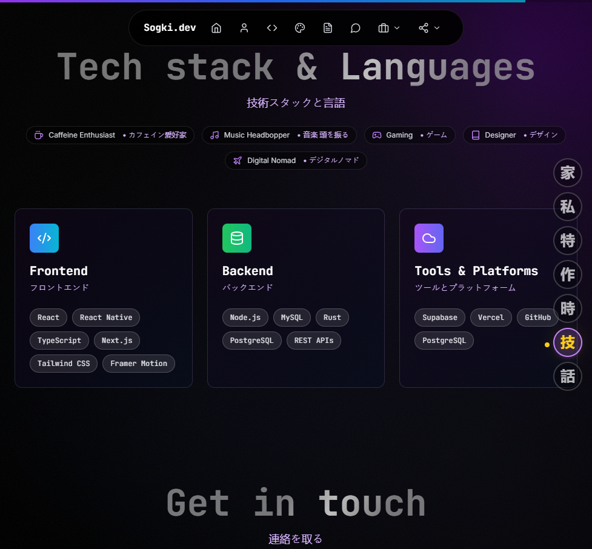
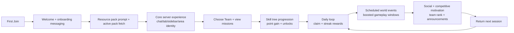
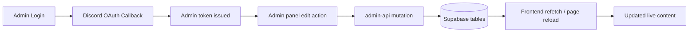
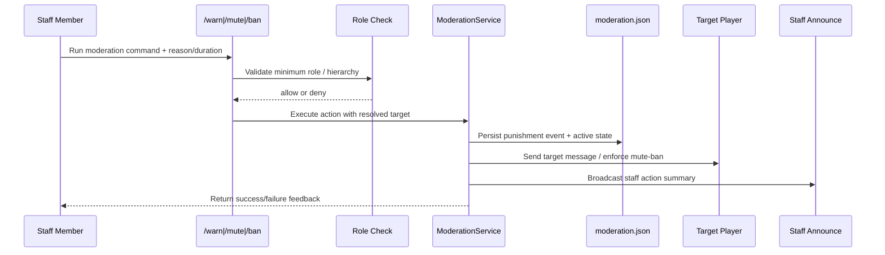
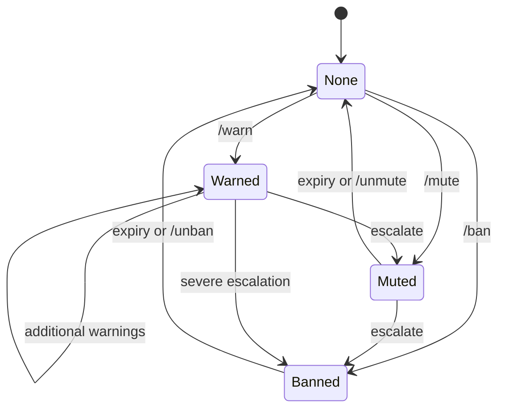
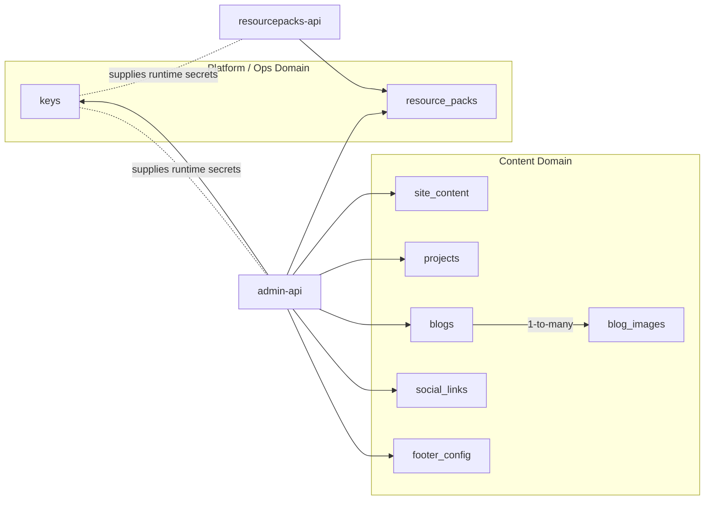
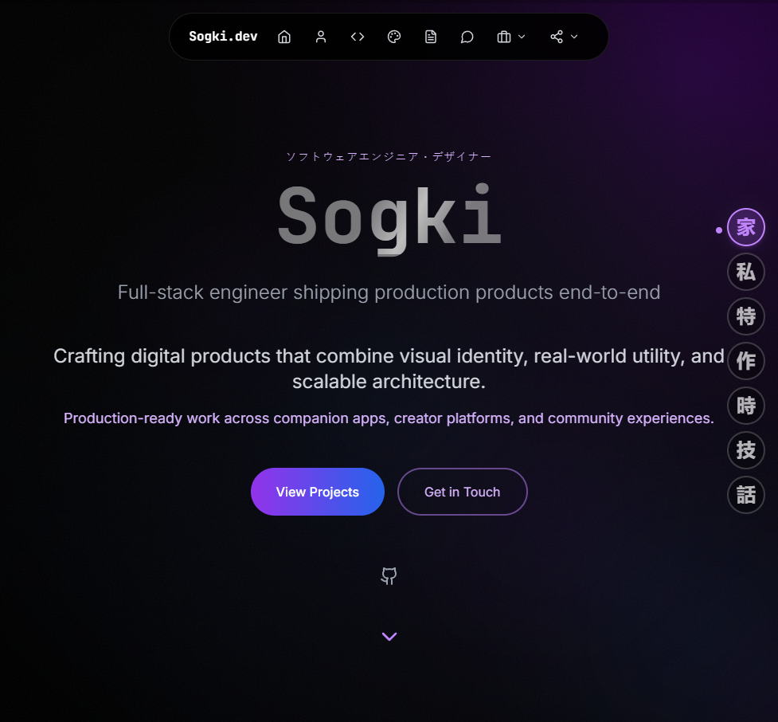

# Sogki Platform - Internal Project Rundown

<p align="center"><strong>Private full-stack platform for <code>sogki.dev</code> and Cobblemon live operations.</strong></p>
<p align="center">Web product, admin CMS, backend APIs, and in-game systems in one repository.</p>

<p align="center">
  
</p>

<p align="center">
  <a href="#quick-stats">Quick Stats</a> •
  <a href="#how-data-moves">Data Flows</a> •
  <a href="#resource-pack-manager-spotlight">Resource Pack Manager</a> •
  <a href="#6-cobblemon-mod-deep-dive-sogki-rp-manager">Cobblemon Mod</a> •
  <a href="#api-contract-appendix">API Contracts</a> •
  <a href="#operations-playbook">Ops Playbook</a>
</p>

| Surface | Role | Stack |
|---|---|---|
| Portfolio Web | Public product experience and content rendering | `React` `TypeScript` `Vite` |
| Admin CMS | Internal control panel for content and operations | `React Router` `Supabase Edge Functions` |
| Backend Data/API | Persistence, auth callbacks, upload and pack endpoints | `Postgres` `Storage` `Deno Functions` |
| Cobblemon Mod | In-game UX, progression, moderation, and protection systems | `Fabric 1.21.1` `Java/Kotlin` |

---

## Visual Snapshots

<p align="center">
  
  
</p>

## Platform Signals

- `Scope` Private internal platform
- `Frontend` React + TypeScript + Framer Motion + Tailwind
- `Backend` Supabase Postgres + Storage + Edge Functions
- `Game` Fabric 1.21.1 mod (`sogki-rp-manager`)

## Quick Stats

| Domain | Metric | Value |
|---|---|---|
| Backend | SQL migrations | `12` |
| Backend | Edge Functions | `3` |
| Data | Create-table definitions | `10` |
| Cobblemon mod | Example config files | `20` |
| Cobblemon mod | Documented command routes | `33+` |

> **At a glance:** this repo is intentionally product-shaped, not project-shaped - each layer (web, admin, API, mod) ships as one operational system.

---

## Image Placeholder Map

All placeholder visuals live in `docs/assets/placeholders/` and are safe to replace with your own screenshots/media.

| Placeholder file | Intended section |
|---|---|
| `01-hero-banner.png` | Header / opening hero |
| `02-stack-overview.png` | Stack and architecture overview |
| `03-data-flow.png` | Data flow sections |
| `04-security-model.png` | Security model and trust boundaries |
| `05-resourcepack-admin.png` | Resource pack manager (admin view) |
| `06-mod-ux.png` | Cobblemon mod in-game UX |
| `07-moderation-ui.png` | Moderation system visuals |
| `08-api-debug.png` | API contract/debug examples |
| `09-ops-runbook.png` | Operations playbook |
| `10-roadmap-visual.png` | Roadmap/planning visual |

> Replace any file with your own image while keeping the same filename/path and the README will update automatically.

---

## Project Philosophy

I built this as a product-first system, not just a website.

- **Frontend experience**: cinematic UI, motion, custom sections, branded interaction
- **Operational control**: admin tooling to edit content without hardcoding
- **Data ownership**: all dynamic content and config backed by structured tables
- **Cross-platform utility**: the same stack supports web users and Minecraft users

---

## Interactive Index

Use this as a chapter navigator. Each row is a focused reading path.

| Path | Jump to |
|---|---|
| 📌 Platform overview | [Quick Stats](#quick-stats), [Project Philosophy](#project-philosophy), [Core Stack I Use](#core-stack-i-use) |
| 🏗️ Architecture and data | [How Data Moves](#how-data-moves), [Security Model](#security-model), [Schema Glossary](#schema-glossary), [System Flow](#system-flow-architecture-graph), [Data Relationship Graph](#data-relationship-graph) |
| 🎮 Cobblemon mod deep dive | [Cobblemon Mod Deep Dive](#6-cobblemon-mod-deep-dive-sogki-rp-manager), [Cobblemon Mod Subsystem Flow](#cobblemon-mod-subsystem-flow), [Player Journey and Retention Loop](#player-journey-and-retention-loop) |
| 📦 Resource pack manager | [Resource Pack Manager Spotlight](#resource-pack-manager-spotlight), [Resource Pack Publish Pipeline](#resource-pack-publish-pipeline), [API Contract Appendix](#api-contract-appendix) |
| 🛡️ Moderation and governance | [Moderation Lifecycle Flow](#moderation-lifecycle-flow), [Moderation Punishment State Machine](#moderation-punishment-state-machine), [Moderation Escalation Decision Tree](#moderation-escalation-decision-tree) |
| ✅ Operations and quality | [Testing and Validation Matrix](#testing-and-validation-matrix), [Operations Playbook](#operations-playbook), [Known Constraints and Trade-offs](#known-constraints-and-trade-offs), [Lessons Learned](#lessons-learned), [Roadmap](#roadmap), [Change Log](#change-log) |

<details>
<summary><strong>Interactive: Read by role 👥</strong></summary>

| Role | Recommended chapter order |
|---|---|
| 🧭 Product/owner view | Quick Stats -> Project Philosophy -> Roadmap -> Change Log |
| 🧪 Full-stack engineering view | Core Stack -> How Data Moves -> Security Model -> API Contract Appendix |
| 🕹️ Minecraft systems/operator view | Cobblemon Mod Deep Dive -> Resource Pack Manager Spotlight -> Moderation sections -> Operations Playbook |
| 🚀 New collaborator onboarding | Interactive Index -> Schema Glossary -> System Flow -> Testing Matrix |

</details>

---

## Core Stack I Use

### Frontend

- `React 18`
- `TypeScript`
- `Vite`
- `React Router`
- `Framer Motion`
- `Tailwind CSS`

### Backend / Data

- `Supabase PostgreSQL`
- `Supabase Storage`
- `Supabase Edge Functions (Deno)`
- `@supabase/supabase-js`

### Minecraft Side

- `Fabric 1.21.1`
- Java/Kotlin-based mod architecture in `mods/sogki-rp-manager`

---

## How Data Moves


### Flow A: Public portfolio page render

1. Browser loads React route.
2. Frontend reads public content from Supabase-backed sources (`site_content`, `projects`, `blogs`, etc.).
3. UI sections render based on data + feature flags.

### Flow B: Admin content mutation

1. Admin authenticates through Discord OAuth callback.
2. Frontend stores admin token and sends mutation request to `admin-api`.
3. `admin-api` verifies token/identity and writes via service-role access.
4. Updated data is immediately available to the public frontend.

### Flow C: Cobblemon resource pack consumption

1. Mod/client requests `/api/resourcepacks/active`.
2. `resourcepacks-api` reads active records and returns signed metadata shape.
3. Client uses returned URL and SHA1 for download/integrity flow.

---

## Security Model



- **Public reads only**: content tables intended for site rendering are readable by `anon`/`authenticated` via RLS policies.
- **Admin writes centralized**: mutations are intentionally routed through `admin-api`, not direct browser-side table writes.
- **Identity gate**: admin operations require token chain tied to Discord auth flow.
- **Secret handling**: sensitive credentials stay in Supabase `keys` (non-public entries) and server env vars.
- **Dev bypass boundary**: localhost-only dev token path exists for speed, but scoped to local origin checks.
- **Mod integration guardrails**: public resource pack API exposes only required fields for client consumption.

---

## Schema Glossary

| Table | Purpose | Primary writers | Primary readers |
|---|---|---|---|
| `keys` | Runtime configuration and secrets/public keys split | SQL migrations, admin/ops | Edge Functions, selected frontend key fetches |
| `site_content` | CMS-style key/value content + feature flags | Admin panel via `admin-api` | Public frontend |
| `projects` | Featured project cards/content | Admin panel | Public frontend |
| `blogs` | Blog metadata + markdown content | Admin panel | Public blog routes |
| `blog_images` | Uploaded blog media tracking | `admin-api` upload handlers | Blog rendering |
| `social_links` | Global social handles/URLs | Admin panel | Navbar/footer/contact surfaces |
| `footer_config` | Footer quick links and structure blobs | Admin panel | Public footer UI |
| `resource_packs` | Pack versions, file metadata, active flags, SHA1 | Admin panel + upload path | Mod/client via public API |

---

## How I Built It

### 1) App Routing and Composition

I split the project into two top-level app surfaces:

- Public app (`/*`)
- Admin app (`/admin/*`)

Inside the public app, I route special surfaces (blog, image viewer, graphic design) and use section-based rendering for the main home page experience.

```tsx
<Routes>
  <Route path="/admin/*" element={<AdminApp />} />
  <Route path="/*" element={<App />} />
</Routes>
```

I also use feature flags from content data (`site_content`) to toggle sections like hero/about/projects/contact without code edits.

---

### 2) CMS-Style Content Model

I moved site text/config to the database so I can edit everything from admin.

Key tables I rely on:

- `site_content` (key/value content + section metadata)
- `projects`
- `blogs`
- `social_links`
- `footer_config`
- `resource_packs`
- `keys` (public and private runtime config)

This gives me a dynamic site where most text, labels, and toggles are controlled from data, not redeploys.

---

### 3) Admin API Design

I built one consolidated Edge Function (`admin-api`) as the admin backend.

Patterns used:

- Custom admin JWT verification (Discord identity gated)
- Localhost dev bypass token for faster iteration
- Generic CRUD handlers by resource (`projects`, `social`, `blogs`, etc.)
- Upload endpoints for blog images and resource pack ZIPs
- Service-role DB access, with frontend only calling controlled API routes

The result is a single admin surface that powers all editorial + ops workflows.

---

### 4) Discord-Based Admin Auth

Admin authentication flow:

1. Frontend generates Discord OAuth URL
2. Discord redirects to `auth-discord-callback`
3. Callback issues admin token
4. Frontend stores token and uses it for `admin-api`

This keeps admin access tied to my Discord identity and avoids exposing unsafe write paths client-side.

---

### 5) Resource Pack Delivery System

I implemented an end-to-end pack management system for Cobblemon:

- Admin uploads ZIPs in `/admin/resourcepacks`
- Files go to Supabase Storage bucket (`resourcepacks`)
- Metadata + SHA1 saved in `resource_packs`
- Public API exposes:
  - `/api/resourcepacks/active`
  - `/api/resourcepacks/:id` (redirect to file URL)

This supports clean versioning, integrity checks (SHA1), and active pack orchestration.

## Resource Pack Manager Spotlight

This subsystem is one of the most important bridges between web operations and in-game delivery.

- Admin-side upload, metadata, activation, and versioning live in `/admin/resourcepacks`
- Storage layer holds ZIP binaries (`resourcepacks` bucket)
- Database layer tracks manifest fields (`resource_packs` table)
- Public delivery layer serves active packs and redirect download endpoints
- Mod/client layer consumes pack URLs + SHA1 for integrity-aware flow


<details>
<summary><strong>Interactive: Resource Pack Manager lifecycle</strong></summary>

| Stage | Where it happens | Output |
|---|---|---|
| Upload | Admin panel + `admin-api` | ZIP validated and stored |
| Metadata write | `resource_packs` table | Name/version/sha1/active rows |
| Public exposure | `resourcepacks-api` | `/api/resourcepacks/active` payload |
| Client pull | Mod join/on-demand flow | Download URL + integrity hash |
| In-game onboarding | Client prompt UI | Player pack install experience |

</details>

---

### 6) Cobblemon Mod Deep Dive (`sogki-rp-manager`)

This is a hybrid client/server Fabric mod that handles both player-facing UX and server operations.

I built it as a live operations layer for the Cobblemon server, not just a visual add-on.


#### What is included in the mod

- **Client UX systems**
  - Join-time resource pack prompt screen
  - Active pack fetch from `https://sogki.dev/api/resourcepacks/active`
  - Per-pack download or one-click "Download All"
  - First-join and returning-player welcome messaging + configurable sounds
- **Server presentation systems**
  - Template-driven global chat (`chat.yml`)
  - Multi-line tablist header/footer (`tablist.yml`)
  - Sidebar templating (`sidebar.yml`)
  - Area enter/leave messaging via chat/actionbar/title routes
  - Spawn set/teleport workflow (`/setspawn`, `/spawn`)
  - Cobblemon announcement broadcasts (`announcements.json`)
- **Progression and retention systems**
  - Daily streak rewards (`/claim`, `/claimmenu`)
  - Quiz rounds with timers, answer matching, and item rewards (`quiz.json`)
  - Team selection + team stats + mission tracking
  - Skill tree with unlockable nodes and point economy
  - Titles system and title-position rendering (prefix/suffix)
  - World event scheduler with per-event multipliers/announcements
- **Protection and moderation systems**
  - Region and town protection rules (`regions.json`, `cobbletown.json`)
  - Villager-focused safety toggles (zombie fear + anti-mob damage options)
  - Staff moderation pipeline with warn/mute/ban/unmute/unban
  - Staff role hierarchy and permission thresholds (`moderation.yml`)
- **Operational integrations**
  - Discord online/offline + event embeds
  - Optional remote config behavior
  - Admin diagnostics and preview commands for live validation

#### Full mod feature coverage checklist

This checklist explicitly tracks the major feature systems implemented in the Fabric mod.

- [x] Client resource pack onboarding prompt + per-pack download flow
- [x] Client welcome/join messaging + configurable sound cues
- [x] Global chat format templates and placeholder rendering
- [x] Multi-line tablist + sidebar rendering/preview pipeline
- [x] Area/town enter-leave messaging routes (chat/actionbar/title)
- [x] Spawn management (`/setspawn`, `/spawn`)
- [x] Daily streak and claim reward system (`/claim`, `/claimmenu`)
- [x] **Quiz system** (`quiz.json`, timed rounds, winner rewards, admin start/skip/status)
- [x] Team selection, team status, and team progression services
- [x] Team missions and team scoreboard/hologram support
- [x] Skill tree economy + unlock/reset/admin grant controls
- [x] Skill tooltip templating (`skill-tooltips.yml`)
- [x] Titles system and title-position controls (`titles.yml`)
- [x] World events scheduler + forced event controls + multipliers
- [x] Region protection + Cobbletown mapping/protection rules
- [x] Villager safety controls (mob damage + zombie fear behavior)
- [x] Discord status/event embeds with Supabase/env credential lookup
- [x] Moderation commands + moderation GUI + role hierarchy enforcement
- [x] Remote config override support (`features.json -> remoteConfig`)

> Coverage source: mod services, command surface, and `config-example/*` feature/config files.

#### Main gameplay/ops capabilities

- **Resource pack onboarding loop**: server advertises active packs from the website API, client gets a guided prompt UX, and players can install packs without digging through external links.
- **Server identity control**: chat/tab/sidebar/team-scoreboard are all template + placeholder based, so branding and gameplay info stay consistent everywhere.
- **Live quiz loop**: automated/admin-triggered quizzes award winners and integrate with mission/skill/event systems.
- **Team ecosystem**: players choose teams, gain points, track rankings, run missions, and receive passive effects while on team.
- **Skill progression**: point gains come from deterministic milestones and chance-based procs, with daily caps and unlock requirements.
- **Calendar events**: events can run by day-of-week/time windows with custom start/end messaging and behavior overrides.
- **Moderation workflow**: punishment actions include reason presets, durations, staff notifications, target notifications, and configurable ban screen messaging.

#### Commands available

- **Player command surface**
  - `/claim`, `/claimmenu`, `/spawn`
  - `/team`, `/teams`, `/team choose <...>`, `/missions`
  - `/skills`, `/skills status`, `/skills tree`, `/skills unlock <nodeId>`, `/skills reset`
- **Admin command surface**
  - `/setspawn`
  - `/sogkiadmin reload`
  - `/sogkiadmin quiz start|skip|status`
  - `/sogkiadmin discord test`
  - `/sogkiadmin tab preview`, `/sogkiadmin sidebar preview`
  - `/sogkiadmin events status|list|start <eventId>|end`
  - `/sogkiadmin scoreboard ...`, `/sogkiadmin teamscoreboard ...`
  - `/sogkiadmin announce`, `/sogkiadmin whereami`, `/sogkiadmin checkregion`
- **Moderation aliases**
  - `/warn`, `/mute`, `/ban`, `/unmute`, `/unban`
  - These route through the mod moderation service with role-gated access.

#### Config-driven architecture (what I can tune live)

The mod is intentionally config-heavy so behavior can be tuned quickly:

- **Core JSON**: `features.json`, `messages.json`, `announcements.json`, `area.json`
- **Progression**: `streak.json`, `teams.json`, `skill-tree.json`, `world-events.json`
- **Protection/ops**: `regions.json`, `cobbletown.json`, `discord.json`, `quiz.json`
- **Templates (YAML)**: `chat.yml`, `tablist.yml`, `sidebar.yml`, `team-messages.yml`, `team-scoreboard.yml`
- **Extra systems**: `titles.yml`, `skill-tooltips.yml`, `moderation.yml`

Template placeholders are extensive (`player`, `coords`, `team`, `pokedex`, `skill`, `event`, etc.), enabling rich context-aware UI text without changing code.

#### How it connects to the web platform

- Resource pack metadata is authored in web admin and stored in Supabase.
- Public endpoint `/api/resourcepacks/active` is consumed by the mod/client flow.
- Discord bot credentials can be sourced from Supabase `keys`, unifying secrets management.

This is the bridge between `sogki.dev` operations and in-game player experience: web-admin controlled data on one side, live gameplay systems on the other.

#### Cobblemon mod subsystem flow

```mermaid
flowchart TD
  P[Player Join / Actions] --> CL[Client Layer\njoin prompt + welcome UX]
  CL --> RP[/api/resourcepacks/active]
  RP --> RPA[resourcepacks-api]
  RPA --> RDB[(resource_packs table)]
  RPA --> RST[(resourcepacks bucket)]

  P --> CMD[Command Layer]
  CMD --> GAME[Gameplay Services\nstreak + teams + skills + titles + events]
  CMD --> MODR[Moderation Services\nwarn/mute/ban + role hierarchy]
  CMD --> PRES[Presentation Services\nchat + tablist + sidebar + team scoreboard]
  CMD --> PROT[Protection Services\nregions + cobbletown + anti-grief toggles]

  CFG[Config Surface\njson + yml templates] --> GAME
  CFG --> MODR
  CFG --> PRES
  CFG --> PROT

  GAME --> DISC[Discord Integration\nstatus + event embeds]
  MODR --> DISC
  DISC --> KEYS[(Supabase keys / env fallback)]
```

#### Player journey and retention loop



<details>
<summary><strong>Interactive: Player journey stage breakdown (click to expand)</strong></summary>

| Stage | What the player sees | Backend/Config systems involved |
|---|---|---|
| First Join | Welcome text, onboarding feel, server identity | `messages.json`, client join/welcome settings |
| Resource Packs | Download prompts and one-click install flow | `/api/resourcepacks/active`, `resource_packs`, `resourcepacks` bucket |
| Core Experience | Styled chat, tablist, sidebar, area transitions | `chat.yml`, `tablist.yml`, `sidebar.yml`, `area.json` |
| Team Entry | Team pick, team status, mission framing | `teams.json`, team services, mission tracking |
| Skill Progression | Skill points and unlock choices | `skill-tree.json`, `skill-tooltips.yml`, skill player data |
| Daily Retention | Claim command, streak progression rewards | `streak.json`, reward templates/messages |
| Event Participation | Time-windowed gameplay modifiers and announcements | `world-events.json`, event scheduler, Discord embeds |
| Social Reinforcement | Team rankings, scoreboard, announcements | `team-scoreboard.yml`, `team-messages.yml`, announcement templates |

</details>

#### Admin content update flow



#### Resource pack publish pipeline

```mermaid
flowchart LR
  U[Upload ZIP in /admin/resourcepacks] --> V[admin-api validation\nzip + size + metadata]
  V --> S[(resourcepacks storage bucket)]
  S --> M[(resource_packs metadata row)]
  M --> A[/api/resourcepacks/active]
  A --> C[Mod/client fetch]
  C --> D[Download + SHA1 verify path]
```

#### Moderation lifecycle flow




#### Moderation punishment state machine



#### Moderation escalation decision tree

```mermaid
flowchart TD
  X[Incident detected] --> Y{Severity / repetition?}
  Y -->|Low + first-time| W[/warn]
  Y -->|Repeated disruption| MU[/mute]
  Y -->|Severe abuse / cheating| BA[/ban]
  W --> Z{Behavior improves?}
  Z -->|Yes| N[No further action]
  Z -->|No| MU
  MU --> Q{Post-mute behavior}
  Q -->|Improves| N
  Q -->|Continues / escalates| BA
```

<details>
<summary><strong>Interactive: Config file map (click to expand)</strong></summary>

| Area | Files | What they control |
|---|---|---|
| Core behavior | `features.json`, `messages.json`, `announcements.json`, `area.json` | Feature toggles, message templates, announcements, area enter/leave routing |
| Progression | `streak.json`, `teams.json`, `skill-tree.json`, `world-events.json` | Daily rewards, team systems, skill unlock economy, scheduled event modifiers |
| Protection & ops | `regions.json`, `cobbletown.json`, `discord.json`, `quiz.json`, `moderation.yml` | Build/place protection, town mapping, Discord bridge, quiz logic, punishments/roles |
| UI templates | `chat.yml`, `tablist.yml`, `sidebar.yml`, `team-messages.yml`, `team-scoreboard.yml`, `titles.yml`, `skill-tooltips.yml` | Chat/tab/sidebar/title rendering, scoreboards, tooltip formatting |

</details>

<details>
<summary><strong>Interactive: Cobblemon command matrix (click to expand)</strong></summary>

| Scope | Commands | Purpose |
|---|---|---|
| Player economy | `/claim`, `/claimmenu` | Daily streak claim and reward status |
| Player progression | `/team`, `/teams`, `/missions`, `/skills` (+ subcommands) | Team selection, mission loop, skill tree advancement |
| Admin diagnostics | `/sogkiadmin whereami`, `/sogkiadmin checkregion` | Region and location debugging |
| Admin rendering preview | `/sogkiadmin tab preview`, `/sogkiadmin sidebar preview` | Validate templates before rollout |
| Admin live ops | `/sogkiadmin events ...`, `/sogkiadmin announce ...`, `/sogkiadmin reload` | Event control, server announcements, config reload |
| Staff moderation | `/warn`, `/mute`, `/ban`, `/unmute`, `/unban` | Enforcement pipeline with role checks and tracked punishments |

</details>

<details>
<summary><strong>Interactive: Config cookbook (if you want X, edit Y)</strong></summary>

| Goal | Edit these files first | Notes |
|---|---|---|
| Change chat identity/branding | `chat.yml`, `messages.json` | Keep placeholders aligned with runtime context |
| Adjust daily reward cadence | `streak.json`, `messages.json` | Supports multi-item rewards and templated outputs |
| Rebalance skills/progression | `skill-tree.json`, `skill-tooltips.yml` | Tune costs, unlock chains, and tooltip clarity together |
| Tune event windows/boosts | `world-events.json` | Prefer schedule windows for predictable live ops |
| Tighten/relax protection zones | `regions.json`, `cobbletown.json` | Use radius mode or cuboid mode per area |
| Update moderation policy tone | `moderation.yml` | Reasons, durations, role gates, and user-facing messages live here |
| Refresh title system language | `titles.yml` | Configure title display and positioning behavior |

</details>

<details>
<summary><strong>Interactive: Feature toggle map</strong></summary>

| Feature | Key / Config | Surface impacted |
|---|---|---|
| Hero section visibility | `site_content -> feature.show_hero` | Homepage hero |
| About visibility | `site_content -> feature.show_about` | About section |
| Features visibility | `site_content -> feature.show_features` | Feature showcase section |
| Projects visibility | `site_content -> feature.show_projects` | Featured projects section |
| Contact visibility | `site_content -> feature.show_contact` | Contact section |
| In-game feature controls | `features.json` | Server-side systems and command behaviors |
| Area display routing | `area.json` (`showActionBar/showChat/showTitle`) | Player enter/leave notifications |

</details>

<details>
<summary><strong>Interactive: Command cookbook (goal -> command -> expected effect)</strong></summary>

| Goal | Command | Expected effect |
|---|---|---|
| Verify current protected zone | `/sogkiadmin checkregion` | Prints protection context at current location |
| Preview tab styling quickly | `/sogkiadmin tab preview` | Shows current tablist template output live |
| Force-test a world event | `/sogkiadmin events start <eventId>` | Activates selected event outside normal schedule |
| Return to automatic events | `/sogkiadmin events end` | Stops forced event and reverts to schedule mode |
| Give a player skill points | `/sogkiadmin skills grant <player> <points>` | Updates progression economy immediately |
| Moderate disruptive behavior | `/warn` -> `/mute` -> `/ban` | Escalating staff action path with notifications |
| Clear punishment state | `/unmute` or `/unban` | Removes active punishment and updates history |

</details>

---

## System Flow (Architecture Graph)

```mermaid
flowchart LR
  U[Public Users] --> FE[React Frontend]
  AD[Admin User] --> ADMIN[Admin Panel]

  FE -->|Public reads| DB[(Supabase Postgres)]
  ADMIN -->|Bearer token| API[admin-api Edge Function]
  API --> DB
  API --> ST[(Supabase Storage)]

  MOD[sogki-rp-manager] --> RP[/api/resourcepacks/active]
  MC[Minecraft Clients] --> RP
  RP --> RPF[resourcepacks-api Edge Function]
  RPF --> DB
  RPF --> ST

  DISCORD[Discord OAuth] --> AUTH[auth-discord-callback]
  AUTH --> ADMIN
```

## Data Relationship Graph



---

## API Contract Appendix


<details>
<summary><strong>Public: Active resource packs response</strong></summary>

`GET /api/resourcepacks/active`

```json
[
  {
    "url": "https://sogki.dev/api/resourcepacks/123e4567-e89b-12d3-a456-426614174000",
    "sha1": "abc123def4567890abc123def4567890abc123de",
    "name": "Cobblemon Main Pack",
    "version": "1.2.0",
    "description": "Primary production pack",
    "size": 83425231,
    "file_name": "cobblemon-main-v1.2.0.zip"
  }
]
```

</details>

<details>
<summary><strong>Admin: Site content upsert payload</strong></summary>

`POST /functions/v1/admin-api/site_content`

```json
{
  "key": "hero.subtitle",
  "value": "Full-stack engineer shipping production products end-to-end",
  "content_type": "text",
  "section": "hero",
  "label": "Hero subtitle"
}
```

</details>

<details>
<summary><strong>Admin: Resource pack upload fields</strong></summary>

`POST /functions/v1/admin-api/resourcepacks/upload` (multipart form)

- `file` (`.zip`)
- `filename`
- `name`
- `version`
- `is_active`
- `auto_deactivate_previous`
- `group_key` (optional)
- `description` (optional)

</details>

---

## Experience Gallery (Interactive Media)

Use this section as a living visual showcase. Add short loops/screenshots as features evolve.

<details>
<summary><strong>Admin editing flow preview (drop-in slot)</strong></summary>

`docs/assets/demo-admin-edit.gif`

</details>

<details>
<summary><strong>Resource pack publish preview (drop-in slot)</strong></summary>

`docs/assets/demo-resourcepack-upload.gif`

</details>

<details>
<summary><strong>Moderation workflow preview (drop-in slot)</strong></summary>

`docs/assets/demo-moderation-flow.gif`

</details>

### Before / After snapshots

- **Before**: static hardcoded content and one-off updates
- **After**: CMS-style table-driven content with admin controls and immediate effect
- **Before**: manual resource pack sharing
- **After**: managed upload + active API + in-game onboarding flow

---

## Notable Engineering Choices

- Data-driven sections with feature flags instead of hardcoded visibility
- Single admin function with resource-based routing to keep API surface consistent
- Storage + metadata split (files in bucket, records in SQL)
- SHA1 checksum handling for pack integrity verification
- Distinct public and admin runtime paths with deliberate auth boundaries
- Modular monorepo separation: frontend, supabase backend, and Minecraft mod

---

## Testing and Validation Matrix

| Area | Validation style | What is checked |
|---|---|---|
| Frontend routes | Manual smoke + runtime checks | `/`, `/blog`, `/blog/:slug`, `/admin/*` rendering and data hydration |
| Admin auth | OAuth + token validation | Callback flow, token persistence, protected mutation behavior |
| Admin CRUD | Manual integration | Create/edit/delete for content entities and media paths |
| Resource packs | End-to-end manual | Upload -> API visibility -> mod/client fetch integrity |
| Mod commands | In-server command verification | Player/admin/staff command behavior and permission gates |
| Moderation | Scenario-based manual tests | warn/mute/ban lifecycle, expiry/clear behavior, message templates |
| Config safety | Controlled reload checks | YAML/JSON config parse resilience and fallback behavior |

---

## Operations Playbook



### If website content looks wrong

1. Check relevant table rows (`site_content`, `projects`, `blogs`, `footer_config`).
2. Validate admin mutation path and recent writes.
3. Confirm feature flags are enabled for expected sections.

### If admin mutations fail

1. Validate admin token state in client session.
2. Confirm `admin-api` is deployed and reachable.
3. Check `keys` values for auth and secret dependencies.

### If resource packs are not visible in-game

1. Confirm pack row exists and `is_active = true` in `resource_packs`.
2. Validate file exists in `resourcepacks` storage bucket.
3. Hit `/api/resourcepacks/active` directly and inspect payload shape.

### If moderation behavior is inconsistent

1. Review `moderation.yml` role hierarchy and minimum role gates.
2. Validate active punishment state and expiration windows.
3. Check message templates for placeholders and formatting mismatches.

---

## Known Constraints and Trade-offs

- Single `admin-api` keeps operations simple, but centralizes a large surface area in one function.
- Data-driven flexibility increases operational power, but requires strict table/keys hygiene.
- Manual integration testing is effective for gameplay flows, but slower than a fully automated suite.
- Rich config support maximizes tuning speed, but raises complexity in docs and operator onboarding.
- Localhost dev bypass improves iteration speed while adding an extra auth branch to maintain.

---

## Lessons Learned

- A content-heavy product matures faster once data modeling is prioritized early.
- Separating file storage metadata from binary storage keeps APIs cleaner and safer.
- In-game UX improves significantly when onboarding (packs/messages/navigation) is treated as product design.
- Moderation tooling needs both strict permission gates and great operator ergonomics.
- Cross-system projects succeed when public APIs expose only the minimum contract needed by clients.

---

## Roadmap


### Done

- Unified web + admin + Supabase + Cobblemon architecture
- Data-driven site content and feature flags
- Resource pack pipeline from upload to in-game fetch
- Team/skill/event/moderation operational systems in mod

### In Progress

- Continuous polish of admin operator UX and diagnostics
- Expanded documentation around config examples and playbooks
- Additional visual walkthrough assets for onboarding collaborators

### Next

- Automated regression checks for key admin and API flows
- Extended observability for edge function failures and mod integrations
- Additional in-game analytics hooks for balancing progression systems

---

## Change Log

### 2026-03-20

- Created unified internal README for web + backend + mod architecture.
- Added Cobblemon deep-dive with command/config/system breakdowns.
- Added multiple Mermaid diagrams (architecture, subsystem, journey, moderation, pipelines).
- Added interactive sections (`<details>`) for command matrices and config maps.
- Added security model, schema glossary, API appendix, ops playbook, trade-offs, lessons, and roadmap.

---

## Important Repo Areas

- `src/` - frontend and admin UI
- `src/pages/admin/` - admin screens and workflows
- `src/context/` - app/auth/content providers
- `supabase/migrations/` - schema and seed history
- `supabase/functions/` - Edge Function API layer
- `mods/sogki-rp-manager/` - Fabric mod + config + dev-server tooling
- `docs/` - focused subsystem documentation

